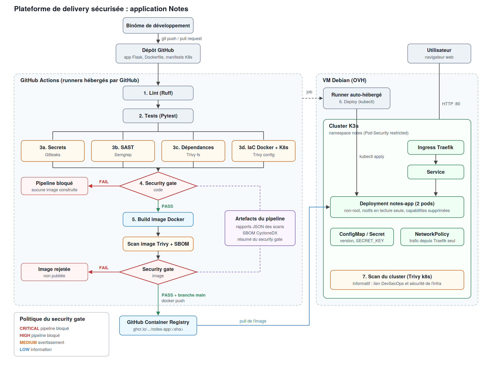

# Notes : plateforme de delivery sécurisée

Application Flask de prise de notes livrée par une chaîne CI/CD DevSecOps, du commit jusqu'au déploiement sur un cluster K3s hébergé sur une VM Debian chez OVH.



## Application

| Route | Rôle |
|---|---|
| `GET /` | page HTML listant les notes |
| `GET /health` | état et version de l'application |
| `GET /api/notes` | liste des notes |
| `POST /api/notes` | création d'une note (`{"title": "..."}`) |
| `GET /api/notes/<id>` | lecture d'une note |
| `DELETE /api/notes/<id>` | suppression d'une note |

Lancer en local :

```bash
python3 -m venv .venv && source .venv/bin/activate
pip install -r requirements-dev.txt
pytest
flask --app app run
```

## Pipeline

| Étape | Outil | Bloquant |
|---|---|---|
| 1. Lint | Ruff | oui |
| 2. Tests | Pytest | oui |
| 3a. Secrets | Gitleaks | via le security gate |
| 3b. SAST | Semgrep (règles p/python, p/flask et règles maison dans `.semgrep/`) | via le security gate |
| 3c. Dépendances | Trivy fs | via le security gate |
| 3d. IaC Docker + Kubernetes | Trivy config | via le security gate |
| 4. Security gate (code) | `scripts/security_gate.py` | CRITICAL et HIGH |
| 5. Build, scan image, SBOM | Docker, Trivy image | CRITICAL et HIGH |
| 6. Déploiement | runner auto-hébergé, kubectl, K3s | échec si le rollout ou le smoke test échoue |
| 7. Scan du cluster | Trivy k8s | non (informatif) |

Politique du security gate : CRITICAL et HIGH bloquent, MEDIUM génère un avertissement, LOW est informatif. Un rapport manquant bloque aussi (fail closed).

Les étapes 5 (push) à 7 ne s'exécutent que sur la branche `main`.

Rapport du projet : [docs/RAPPORT.md](docs/RAPPORT.md)
