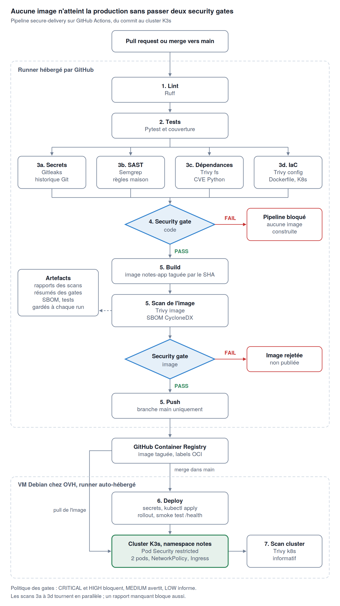
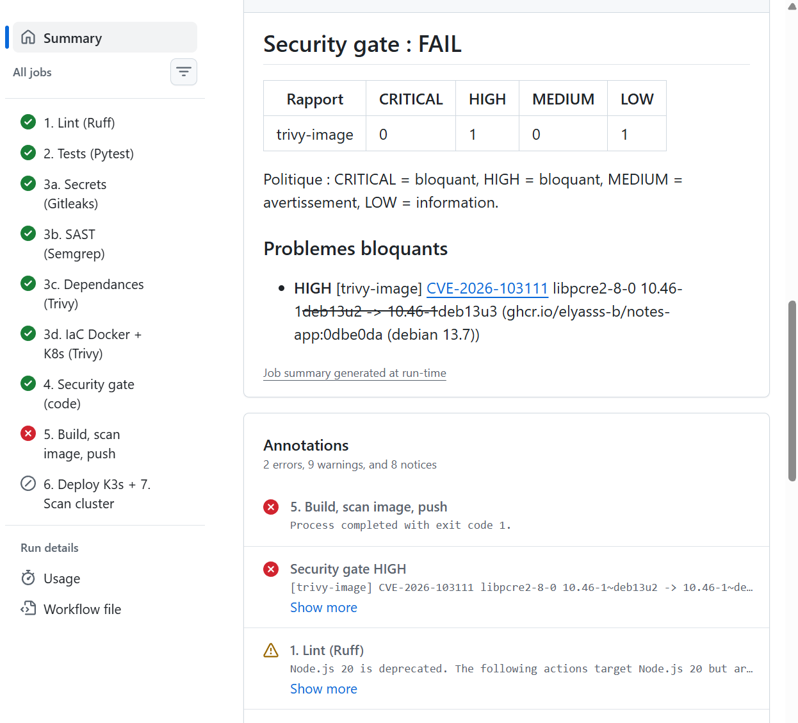
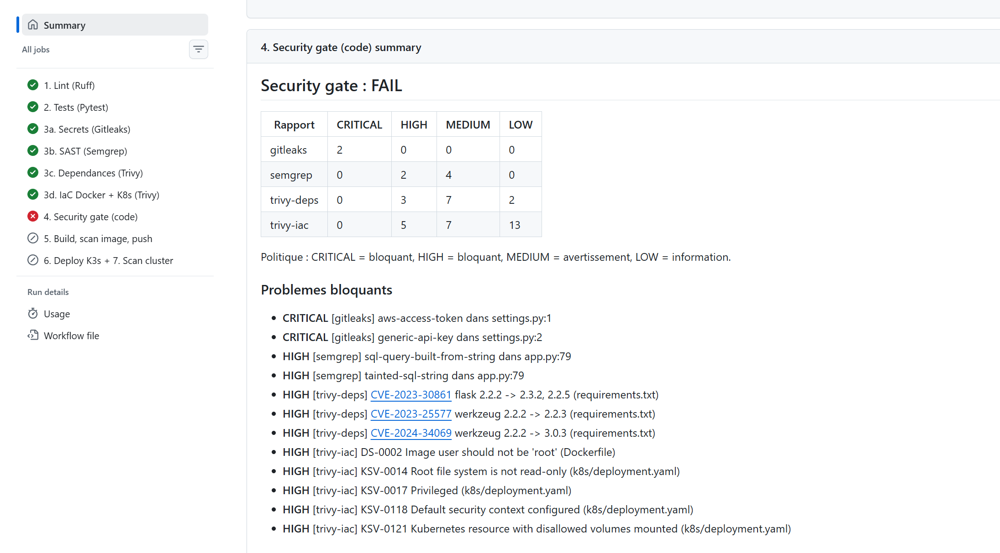

# Rapport : plateforme de delivery sécurisée

Elyas Boutahar (elyasss-b) et Chayma Kalmani (chayma38)

- Dépôt : https://github.com/elyasss-b/projet-devsecops
- Application déployée : http://5.196.223.25/
- Pipeline : [`.github/workflows/ci.yml`](../.github/workflows/ci.yml)
- Politique de sécurité : [`scripts/security_gate.py`](../scripts/security_gate.py), règles Semgrep maison dans [`.semgrep/`](../.semgrep/)

Le détail technique est dans le code du dépôt. Ce rapport explique nos choix, les règles de travail et ce que nous avons observé.

## 1. Ce que nous avons fait

Nous avons développé une petite application Flask de prise de notes, conteneurisée avec une image durcie (multi-stage, base slim mise à jour au build, utilisateur non-root, pip retiré). Elle est déployée sur un cluster K3s installé sur une VM Debian chez OVH.

Le pipeline GitHub Actions fait le lint et les tests, lance quatre scans en parallèle (Gitleaks, Semgrep, Trivy sur les dépendances, Trivy sur le Dockerfile et les manifests), construit l'image, la scanne, la pousse dans GHCR puis la déploie. Le déploiement passe par un runner auto-hébergé sur la VM, ce qui évite d'exposer l'API Kubernetes sur internet.

## 2. Security gate

Les scanners écrivent un rapport, et c'est notre script `security_gate.py` qui décide. Il est appliqué deux fois : sur le code avant le build, puis sur l'image avant le push.

| Sévérité | Décision |
|---|---|
| CRITICAL | pipeline bloqué |
| HIGH | pipeline bloqué |
| MEDIUM | avertissement |
| LOW | information |

Un secret trouvé par Gitleaks compte comme CRITICAL. Si un rapport manque, le gate échoue aussi. Les exceptions éventuelles se déclarent dans `.trivyignore` avec une justification.

## 3. Règles côté Git et workflow de travail

Personne ne pousse directement sur `main`, y compris le propriétaire du dépôt. Tout passe par une branche et une pull request.

| Règle | Comment c'est appliqué |
|---|---|
| Pull request obligatoire vers `main` | protection de branche GitHub, option « Do not allow bypassing » |
| Relecture par l'autre membre du binôme | 1 approbation obligatoire, l'auteur ne peut pas approuver sa propre PR |
| Sécurité obligatoire avant merge | checks requis : `4. Security gate (code)` et `5. Build, scan image, push` |
| Livraison uniquement depuis `main` | push de l'image et déploiement conditionnés à un merge dans `main` |
| Pas de secret dans le code | push protection GitHub, Gitleaks, secrets GitHub passés en variables d'environnement |
| Contributions externes contrôlées | dépôt public, workflows des forks lancés seulement après approbation manuelle |
| Dépendances à jour | Dependabot (pip, Docker, GitHub Actions) ouvre des PR chaque semaine |
| Droits minimaux dans le pipeline | jeton en lecture par défaut, écriture dans le registry seulement au job de build |

Notre façon de travailler : une branche par modification, une PR, le pipeline tourne, l'autre relit et approuve, puis merge. Le merge déclenche la livraison. Chaque version en production est traçable : `/health` affiche le commit, l'image est taguée avec le même SHA, et l'exécution du pipeline garde les rapports et le SBOM en artefacts.

## 4. SBOM

À chaque build, Trivy produit le SBOM de l'image au format CycloneDX (artefact `sbom.cdx.json`). C'est l'inventaire de tout ce que contient l'image : paquets Debian et bibliothèques Python avec leurs versions. Quand une nouvelle CVE sort, on peut lancer `trivy sbom sbom.cdx.json` pour savoir si la version en production est touchée, sans reconstruire l'image.

## 5. Exemples de CVE

| CVE | Composant | Contexte | Traitement |
|---|---|---|---|
| [CVE-2026-103111](https://nvd.nist.gov/vuln/detail/CVE-2026-103111) | `libpcre2-8-0` de l'image `python:3.12-slim` | vraie CVE HIGH trouvée au premier build, alors que notre code était propre | `apt-get upgrade` ajouté au Dockerfile, le gate image est passé de FAIL à PASS |
| [CVE-2023-30861](https://nvd.nist.gov/vuln/detail/CVE-2023-30861) | Flask 2.2.2 | branche challenge : fuite possible du cookie de session derrière un proxy de cache | bloquée par le gate |
| [CVE-2023-25577](https://nvd.nist.gov/vuln/detail/CVE-2023-25577) | Werkzeug 2.2.2 | branche challenge : déni de service avec des formulaires multipart | bloquée par le gate |
| [CVE-2024-34069](https://nvd.nist.gov/vuln/detail/CVE-2024-34069) | Werkzeug 2.2.2 | branche challenge : exécution de code via le débogueur Werkzeug | bloquée par le gate |

Le premier cas nous a montré l'intérêt de scanner l'image finale : l'image officielle Python n'avait pas encore intégré le correctif Debian.

## 6. Risques principaux

| Risque | Ce qu'on a mis en place | Ce qui reste |
|---|---|---|
| Secret commité | push protection, Gitleaks sur l'historique de la branche | un secret poussé reste dans l'historique Git |
| Dépendance ou image vulnérable | Trivy fs et Trivy image, Dependabot | une CVE publiée après le déploiement n'est vue qu'au build suivant |
| Faille dans le code | Semgrep avec règles maison, validation des entrées, relecture | pas de test dynamique (DAST) |
| Conteneur mal configuré | Trivy config, Pod Security `restricted`, non-root, rootfs en lecture seule | rien d'identifié |
| Contournement du pipeline | protection de `main` sans exception, checks obligatoires | une approbation reste valable après un nouveau commit |
| Compromission du runner | pas de droit d'écriture pour l'extérieur, approbation des workflows de forks, déploiement depuis `main` uniquement | le runner a un accès administrateur au cluster |
| Trafic en clair | seuls les ports 22 et 80 ouverts, API Kubernetes non exposée | pas encore de HTTPS |

## 7. Challenge

La branche `challenge` contient cinq problèmes volontaires : une fausse clé AWS, Flask et Werkzeug en 2.2.2, un Dockerfile root avec le port 22 exposé, un Deployment privilégié qui monte `/` de l'hôte, et une injection SQL avec le mode debug activé. Tout a été détecté : 2 CRITICAL et 12 HIGH bloquants, 18 MEDIUM en avertissement. Le pipeline s'est arrêté avant le build et la PR vers `main` ne pouvait pas être mergée. La fausse clé avait même été refusée dès le push par GitHub, nous l'avons autorisée pour montrer que Gitleaks la trouvait aussi.

## 8. Red team

### Ce que nous avons ouvert aux autres groupes

Les autres groupes ont reçu le lien du dépôt public. Nous ne leur avons pas donné de droit d'écriture : avec ce droit, une branche contenant un workflow modifié aurait pu s'exécuter sur notre runner, donc sur la VM et le cluster. Ils devaient forker le dépôt et proposer leurs attaques par pull request. Leur pipeline ne démarrait qu'après notre approbation, sans accès à nos secrets, et rien ne pouvait être mergé sans gate vert et sans relecture.

### Attaques reçues

[À compléter : groupe, ce qui a été tenté, détecté ou non, par quel outil, décision du gate.]

| Groupe | Attaque tentée | Détectée par | Résultat |
|---|---|---|---|
| | | | |

### Ce que nous avons testé chez les autres

[À compléter si vous avez attaqué d'autres dépôts : ce que vous avez tenté et ce qui est passé ou non.]

## 9. Limites et suite

Les incidents rencontrés nous ont fait corriger la plateforme : passage des secrets par variables d'environnement après une erreur de syntaxe dans le script de déploiement, et limitation de Gitleaks à l'historique de la branche testée car le faux secret de `challenge` bloquait les autres PR.

Avec plus de temps, nous ajouterions dans l'ordre : HTTPS, signature des images avec Cosign et vérification par Kyverno, un compte de service limité pour le runner, un rescan quotidien du SBOM, et l'épinglage des actions GitHub par SHA.
